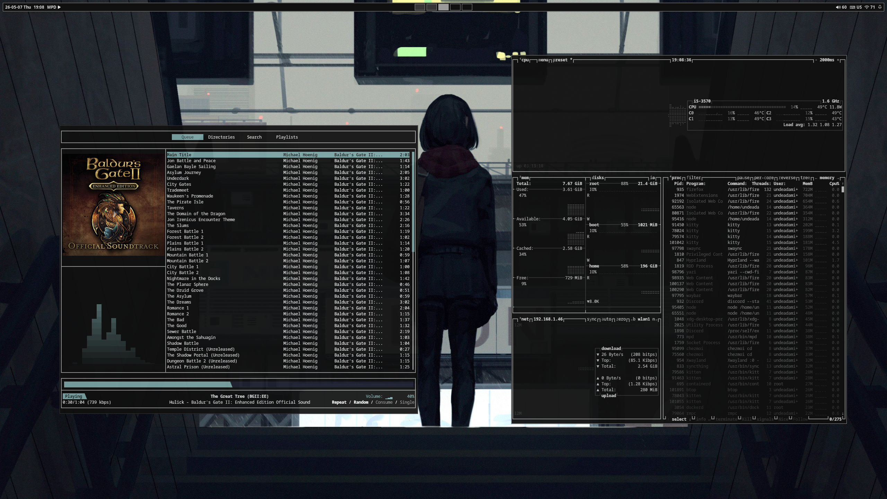
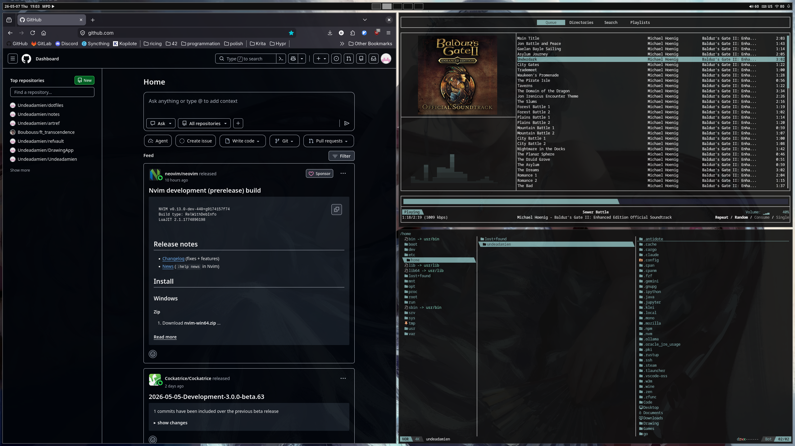

# Dotfiles

Personal dotfiles managed with [chezmoi](https://www.chezmoi.io/) for a Hyprland-based Arch Linux setup.  
A minimal, keyboard-driven Wayland setup focused on speed, consistency, and reproducibility.


<details>
<summary>More screenshots</summary>

<p align="center">
  
  
</p>

</details>

<p align="center">
  <i>Wallpapers from <a href=https://www.instagram.com/guweiz/>Guweiz</a>, <a href=https://www.instagram.com/wlop/>WLOP</a> and <a href=https://www.instagram.com/samdoesarts/>samdoesarts</a></i>
</p>

## Features

### Desktop workflow

- `hyprland` – tiling Wayland compositor
- `hyprlock/hypridle` – lock + idle
- `hyprshot` – screenshot
- `rofi` – launcher
- `swaync` – notifications
- `waybar` – system bar

### Terminal workflow

- `kitty` – terminal
- `mpd/rmpc` – music
- `neovim` – editor
- `tmux` – session manager
- `yazi` – file manager
- `zsh` – shell

> Full package list is available in `./.chezmoidata/packages.yaml`

## Installation

**1. Install chezmoi**

```bash
# https://www.chezmoi.io/install/
sudo pacman -S chezmoi
```

**2. Clone and apply the dotfiles**

```bash
# https://www.chezmoi.io/reference/commands/init/
chezmoi init git@github.com:Undeadamien/dotfiles.git --apply
```

> After installation, reboot or re-login for changes to take effect.

During `chezmoi apply`, multiple [scripts](https://www.chezmoi.io/user-guide/use-scripts-to-perform-actions/) will run, helping with different tasks:

- Install packages (pacman & yay)
- Restart applications
- Cleanup files
